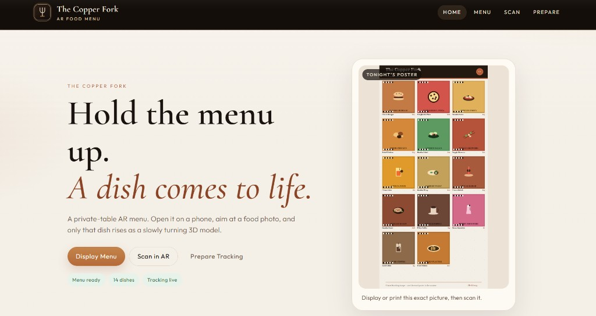
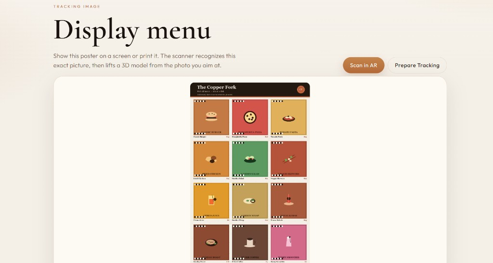
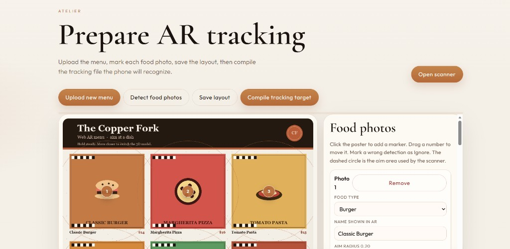
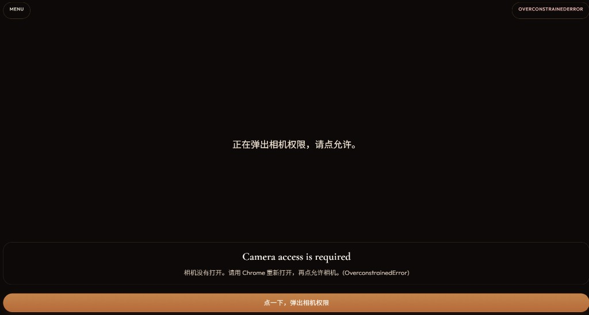

# The Copper Fork · AR Food Menu

Web AR food menu. Open it on a phone, aim at a dish photo on the poster, and only that dish appears as a slowly rotating 3D model.

## Screenshots

### Home

Poster preview and shortcuts to the menu, scanner, and tracking editor.



### Display menu

The tracking poster. Show this on a screen or print it; the scanner must see this same picture.



### Prepare AR tracking

Upload a poster, mark each food photo, save the layout, then compile the tracking file.



### Scan in AR

Phone camera page. Allow the camera, then aim at the poster. Only the dish you point at appears in 3D.



## Pages

| Page | File | Purpose |
| --- | --- | --- |
| Home | `index.php` | Poster preview and QR code for the phone scanner |
| Menu | `menu.php` | Full poster to display or print |
| Prepare | `compile.php` | Upload a poster, mark dishes, compile tracking |
| Scan | `ar.php` | Camera, image tracking, one 3D dish at a time |

## How scanning works

1. Display or print `assets/images/menu.jpg`.
2. Open `ar.php` on a phone over HTTPS.
3. Allow the rear camera.
4. Hold the poster still until the menu locks.
5. Move closer to one food photo. Only that dish’s 3D model appears.

If you change the poster or dish boxes, open Prepare, save the layout, then compile tracking again so `assets/targets/menu.mind` matches the new image.

## Requirements

- PHP 8.0 or newer (8.1 / 8.2 recommended)
- PHP GD (for menu image upload)
- HTTPS on a phone (camera will not open on plain HTTP)
- Writable `assets/images` and `assets/targets`

No database. No Node server. Tracking uses MindAR + Three.js in the browser.

## Local (XAMPP)

1. Place the project in `htdocs` (this folder name can stay `AR_System`).
2. Enable `extension=gd` in `php.ini` and restart Apache.
3. Open `http://localhost/AR_System/`.
4. A computer can test the site on localhost. A phone must use HTTPS.

## cPanel

1. Upload the project into `public_html/Web_Based_AR_FoodMenu_System/`.
2. In MultiPHP Manager choose PHP 8.1 or 8.2.
3. In Select PHP Version → Extensions, enable **gd**.
4. Turn on SSL / AutoSSL and Force HTTPS Redirect.
5. Make `assets/images` and `assets/targets` writable (755 or 775).
6. Confirm `includes/config.php` contains:

```php
define('PUBLIC_ORIGIN', 'https://junzhe.kolejsynergy.com/Web_Based_AR_FoodMenu_System');
```

7. On the phone open Safari or Chrome (not WeChat), allow the camera, then aim at the same poster.

Do not upload `certs/key.pem` or `certs/cert.pem`. Those are only for local HTTPS.

## License

This project is released under the [MIT License](LICENSE).
